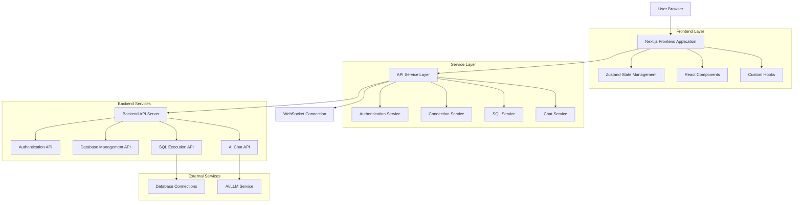
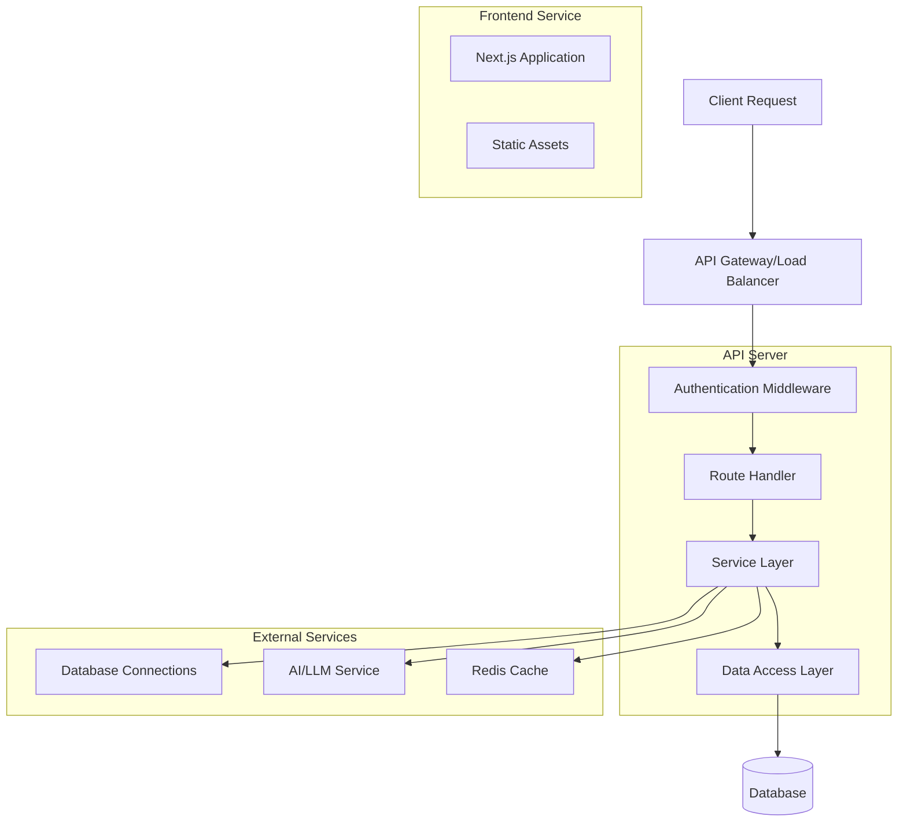
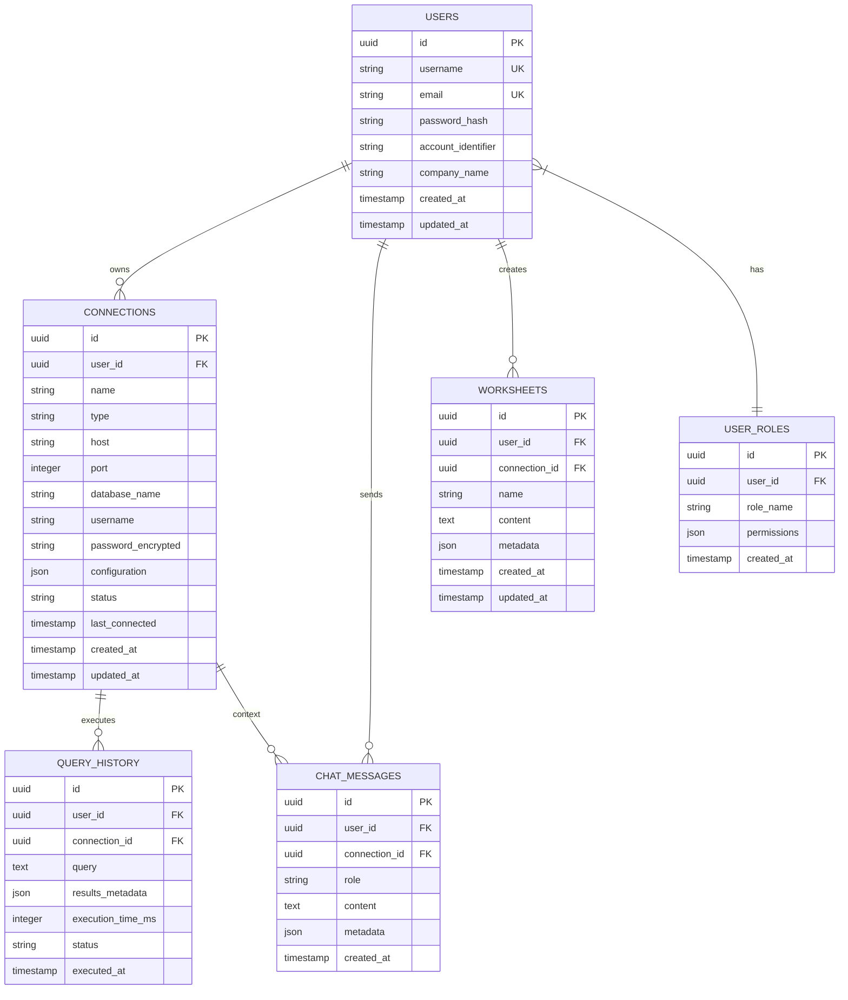

# API Integration Technical Specification

## 1. Architecture Design



## 2. Technology Description

- **Frontend**: React@18 + Next.js@13.5.1 + TypeScript + Tailwind CSS
- **State Management**: Zustand with persistence middleware
- **API Client**: Axios with interceptors for authentication and error handling
- **Real-time Communication**: WebSocket for chat and live updates
- **Form Handling**: React Hook Form + Zod validation
- **Code Editor**: Monaco Editor for SQL editing
- **UI Components**: Radix UI primitives with custom styling

## 3. Route Definitions

| Route | Purpose |
|-------|---------|
| `/` | Landing page with authentication redirect |
| `/login` | User authentication page |
| `/signup` | User registration page |
| `/verify-account` | Account verification page |
| `/dashboard` | Main dashboard with connection overview |
| `/connections` | Database connection management |
| `/sql-editor` | SQL query editor with multi-tab support |
| `/ai-chat` | AI-powered database chat interface |
| `/settings` | User settings and preferences |
| `/settings/profile` | User profile management |
| `/settings/roles` | Role-based access control management |
| `/settings/users` | User management (admin only) |
| `/table/[connectionId]` | Database table browser |

## 4. API Definitions

### 4.1 Authentication API

#### User Login
```
POST /api/v1/auth/login
```

Request:
| Param Name | Param Type | isRequired | Description |
|------------|------------|------------|-------------|
| accountIdentifier | string | true | Account identifier from registration |
| username | string | true | Username |
| password | string | true | User password |

Response:
| Param Name | Param Type | Description |
|------------|------------|-------------|
| success | boolean | Request success status |
| data | object | Authentication data |
| data.token | string | JWT access token |
| data.refreshToken | string | JWT refresh token |
| data.user | object | User information |
| data.expiresIn | number | Token expiration time in seconds |

Example Request:
```json
{
  "accountIdentifier": "ACCT-12345678",
  "username": "johndoe",
  "password": "SecurePass123!"
}
```

Example Response:
```json
{
  "success": true,
  "data": {
    "token": "eyJhbGciOiJIUzI1NiIsInR5cCI6IkpXVCJ9...",
    "refreshToken": "eyJhbGciOiJIUzI1NiIsInR5cCI6IkpXVCJ9...",
    "user": {
      "id": "550e8400-e29b-41d4-a716-446655440000",
      "username": "johndoe",
      "email": "john@example.com",
      "accountIdentifier": "ACCT-12345678"
    },
    "expiresIn": 900
  }
}
```

#### User Registration
```
POST /api/v1/auth/register
```

Request:
| Param Name | Param Type | isRequired | Description |
|------------|------------|------------|-------------|
| username | string | true | Unique username (3-50 characters) |
| email | string | true | Valid email address |
| password | string | true | Password (min 8 chars, complex) |
| confirmPassword | string | true | Password confirmation |
| companyName | string | true | Company/organization name |

Response:
| Param Name | Param Type | Description |
|------------|------------|-------------|
| success | boolean | Registration success status |
| data | object | Registration data |
| data.userId | string | Generated user ID |
| data.accountIdentifier | string | Generated account identifier |

### 4.2 Database Connection API

#### List Connections
```
GET /api/v1/connections
```

Response:
| Param Name | Param Type | Description |
|------------|------------|-------------|
| success | boolean | Request success status |
| data | array | Array of database connections |

#### Create Connection
```
POST /api/v1/connections
```

Request:
| Param Name | Param Type | isRequired | Description |
|------------|------------|------------|-------------|
| name | string | true | Connection display name |
| type | string | true | Database type (snowflake, postgresql, mysql, etc.) |
| host | string | true | Database host |
| port | number | false | Database port |
| database | string | true | Database name |
| username | string | true | Database username |
| password | string | true | Database password |
| ssl | boolean | false | SSL connection flag |

#### Test Connection
```
POST /api/v1/connections/:id/test
```

Response:
| Param Name | Param Type | Description |
|------------|------------|-------------|
| success | boolean | Test success status |
| data | object | Connection test results |
| data.status | string | Connection status (connected/error) |
| data.latency | number | Connection latency in ms |

### 4.3 SQL Execution API

#### Execute Query
```
POST /api/v1/sql/execute
```

Request:
| Param Name | Param Type | isRequired | Description |
|------------|------------|------------|-------------|
| connectionId | string | true | Database connection ID |
| query | string | true | SQL query to execute |
| limit | number | false | Result limit (default: 1000) |

Response:
| Param Name | Param Type | Description |
|------------|------------|-------------|
| success | boolean | Execution success status |
| data | object | Query results |
| data.columns | array | Column definitions |
| data.rows | array | Result rows |
| data.executionTime | number | Query execution time in ms |
| data.rowCount | number | Total number of rows |

### 4.4 AI Chat API

#### Send Chat Message
```
POST /api/v1/chat/message
```

Request:
| Param Name | Param Type | isRequired | Description |
|------------|------------|------------|-------------|
| message | string | true | User message |
| connectionId | string | false | Active database connection |
| context | object | false | Additional context |

Response:
| Param Name | Param Type | Description |
|------------|------------|-------------|
| success | boolean | Request success status |
| data | object | Chat response |
| data.message | string | AI response message |
| data.sqlQuery | string | Generated SQL query (if applicable) |
| data.suggestions | array | Follow-up suggestions |

### 4.5 User Management API

#### Get Current User Roles
```
GET /api/v1/users/current/roles
```

Response:
| Param Name | Param Type | Description |
|------------|------------|-------------|
| success | boolean | Request success status |
| data | array | User roles |

#### Update User Role
```
PUT /api/v1/users/current/role
```

Request:
| Param Name | Param Type | isRequired | Description |
|------------|------------|------------|-------------|
| roleId | string | true | Role ID to assign |

## 5. Server Architecture Diagram



## 6. Data Model

### 6.1 Data Model Definition



### 6.2 Data Definition Language

#### Users Table
```sql
-- Create users table
CREATE TABLE users (
    id UUID PRIMARY KEY DEFAULT gen_random_uuid(),
    username VARCHAR(50) UNIQUE NOT NULL,
    email VARCHAR(255) UNIQUE NOT NULL,
    password_hash VARCHAR(255) NOT NULL,
    account_identifier VARCHAR(20) UNIQUE NOT NULL,
    company_name VARCHAR(255) NOT NULL,
    created_at TIMESTAMP WITH TIME ZONE DEFAULT NOW(),
    updated_at TIMESTAMP WITH TIME ZONE DEFAULT NOW()
);

-- Create indexes
CREATE INDEX idx_users_username ON users(username);
CREATE INDEX idx_users_email ON users(email);
CREATE INDEX idx_users_account_identifier ON users(account_identifier);
```

#### User Roles Table
```sql
-- Create user_roles table
CREATE TABLE user_roles (
    id UUID PRIMARY KEY DEFAULT gen_random_uuid(),
    user_id UUID NOT NULL REFERENCES users(id) ON DELETE CASCADE,
    role_name VARCHAR(50) NOT NULL,
    permissions JSONB DEFAULT '{}',
    created_at TIMESTAMP WITH TIME ZONE DEFAULT NOW()
);

-- Create indexes
CREATE INDEX idx_user_roles_user_id ON user_roles(user_id);
CREATE INDEX idx_user_roles_role_name ON user_roles(role_name);
```

#### Database Connections Table
```sql
-- Create connections table
CREATE TABLE connections (
    id UUID PRIMARY KEY DEFAULT gen_random_uuid(),
    user_id UUID NOT NULL REFERENCES users(id) ON DELETE CASCADE,
    name VARCHAR(255) NOT NULL,
    type VARCHAR(50) NOT NULL CHECK (type IN ('snowflake', 'postgresql', 'mysql', 'mongodb', 'sqlserver')),
    host VARCHAR(255) NOT NULL,
    port INTEGER DEFAULT 5432,
    database_name VARCHAR(255) NOT NULL,
    username VARCHAR(255) NOT NULL,
    password_encrypted TEXT NOT NULL,
    configuration JSONB DEFAULT '{}',
    status VARCHAR(20) DEFAULT 'disconnected' CHECK (status IN ('connected', 'disconnected', 'error')),
    last_connected TIMESTAMP WITH TIME ZONE,
    created_at TIMESTAMP WITH TIME ZONE DEFAULT NOW(),
    updated_at TIMESTAMP WITH TIME ZONE DEFAULT NOW()
);

-- Create indexes
CREATE INDEX idx_connections_user_id ON connections(user_id);
CREATE INDEX idx_connections_type ON connections(type);
CREATE INDEX idx_connections_status ON connections(status);
```

#### Worksheets Table
```sql
-- Create worksheets table
CREATE TABLE worksheets (
    id UUID PRIMARY KEY DEFAULT gen_random_uuid(),
    user_id UUID NOT NULL REFERENCES users(id) ON DELETE CASCADE,
    connection_id UUID REFERENCES connections(id) ON DELETE SET NULL,
    name VARCHAR(255) NOT NULL,
    content TEXT DEFAULT '',
    metadata JSONB DEFAULT '{}',
    created_at TIMESTAMP WITH TIME ZONE DEFAULT NOW(),
    updated_at TIMESTAMP WITH TIME ZONE DEFAULT NOW()
);

-- Create indexes
CREATE INDEX idx_worksheets_user_id ON worksheets(user_id);
CREATE INDEX idx_worksheets_connection_id ON worksheets(connection_id);
CREATE INDEX idx_worksheets_created_at ON worksheets(created_at DESC);
```

#### Query History Table
```sql
-- Create query_history table
CREATE TABLE query_history (
    id UUID PRIMARY KEY DEFAULT gen_random_uuid(),
    user_id UUID NOT NULL REFERENCES users(id) ON DELETE CASCADE,
    connection_id UUID NOT NULL REFERENCES connections(id) ON DELETE CASCADE,
    query TEXT NOT NULL,
    results_metadata JSONB DEFAULT '{}',
    execution_time_ms INTEGER,
    status VARCHAR(20) DEFAULT 'success' CHECK (status IN ('success', 'error', 'timeout')),
    executed_at TIMESTAMP WITH TIME ZONE DEFAULT NOW()
);

-- Create indexes
CREATE INDEX idx_query_history_user_id ON query_history(user_id);
CREATE INDEX idx_query_history_connection_id ON query_history(connection_id);
CREATE INDEX idx_query_history_executed_at ON query_history(executed_at DESC);
```

#### Chat Messages Table
```sql
-- Create chat_messages table
CREATE TABLE chat_messages (
    id UUID PRIMARY KEY DEFAULT gen_random_uuid(),
    user_id UUID NOT NULL REFERENCES users(id) ON DELETE CASCADE,
    connection_id UUID REFERENCES connections(id) ON DELETE SET NULL,
    role VARCHAR(20) NOT NULL CHECK (role IN ('user', 'assistant')),
    content TEXT NOT NULL,
    metadata JSONB DEFAULT '{}',
    created_at TIMESTAMP WITH TIME ZONE DEFAULT NOW()
);

-- Create indexes
CREATE INDEX idx_chat_messages_user_id ON chat_messages(user_id);
CREATE INDEX idx_chat_messages_connection_id ON chat_messages(connection_id);
CREATE INDEX idx_chat_messages_created_at ON chat_messages(created_at DESC);
```

#### Initial Data
```sql
-- Insert default roles
INSERT INTO user_roles (user_id, role_name, permissions) VALUES
-- Default roles will be assigned during user registration
-- ACCOUNTADMIN, DATAENGINEER, DATAANALYST, VIEWER

-- Sample data for development
INSERT INTO users (username, email, password_hash, account_identifier, company_name) VALUES
('demo_user', 'demo@quantrix.ai', '$2b$10$...', 'DEMO-12345678', 'Demo Company');

-- Sample connection for demo
INSERT INTO connections (user_id, name, type, host, database_name, username, password_encrypted, status) VALUES
((SELECT id FROM users WHERE username = 'demo_user'), 'Demo Snowflake', 'snowflake', 'demo.snowflakecomputing.com', 'DEMO_DB', 'demo_user', 'encrypted_password', 'connected');
```

## 7. Service Layer Implementation

### 7.1 Base API Client
```typescript
// lib/api/client.ts
import axios, { AxiosInstance, AxiosRequestConfig } from 'axios';
import { TokenManager } from '@/lib/utils/token-manager';

class ApiClient {
  private client: AxiosInstance;

  constructor() {
    this.client = axios.create({
      baseURL: process.env.NEXT_PUBLIC_API_URL,
      timeout: 30000,
      headers: {
        'Content-Type': 'application/json',
      },
    });

    this.setupInterceptors();
  }

  private setupInterceptors() {
    // Request interceptor for auth token
    this.client.interceptors.request.use(
      (config) => {
        const token = TokenManager.getAccessToken();
        if (token) {
          config.headers.Authorization = `Bearer ${token}`;
        }
        return config;
      },
      (error) => Promise.reject(error)
    );

    // Response interceptor for token refresh
    this.client.interceptors.response.use(
      (response) => response,
      async (error) => {
        if (error.response?.status === 401) {
          const refreshed = await TokenManager.refreshToken();
          if (refreshed) {
            return this.client.request(error.config);
          }
          TokenManager.clearTokens();
          window.location.href = '/login';
        }
        return Promise.reject(error);
      }
    );
  }

  async get<T>(url: string, config?: AxiosRequestConfig): Promise<T> {
    const response = await this.client.get(url, config);
    return response.data;
  }

  async post<T>(url: string, data?: any, config?: AxiosRequestConfig): Promise<T> {
    const response = await this.client.post(url, data, config);
    return response.data;
  }

  async put<T>(url: string, data?: any, config?: AxiosRequestConfig): Promise<T> {
    const response = await this.client.put(url, data, config);
    return response.data;
  }

  async delete<T>(url: string, config?: AxiosRequestConfig): Promise<T> {
    const response = await this.client.delete(url, config);
    return response.data;
  }
}

export const apiClient = new ApiClient();
```

### 7.2 Authentication Service
```typescript
// lib/api/auth.ts
import { apiClient } from './client';
import { TokenManager } from '@/lib/utils/token-manager';

export interface LoginCredentials {
  accountIdentifier: string;
  username: string;
  password: string;
}

export interface AuthResponse {
  success: boolean;
  data: {
    token: string;
    refreshToken: string;
    user: User;
    expiresIn: number;
  };
}

export class AuthService {
  static async login(credentials: LoginCredentials): Promise<AuthResponse> {
    const response = await apiClient.post<AuthResponse>('/api/v1/auth/login', credentials);
    
    if (response.success) {
      TokenManager.setTokens(response.data.token, response.data.refreshToken);
    }
    
    return response;
  }

  static async register(userData: RegisterData): Promise<RegisterResponse> {
    return apiClient.post<RegisterResponse>('/api/v1/auth/register', userData);
  }

  static async logout(): Promise<void> {
    try {
      await apiClient.post('/api/v1/auth/logout');
    } finally {
      TokenManager.clearTokens();
    }
  }

  static async refreshToken(): Promise<TokenResponse> {
    const refreshToken = TokenManager.getRefreshToken();
    return apiClient.post<TokenResponse>('/api/v1/auth/refresh', { refreshToken });
  }

  static async getProfile(): Promise<UserProfile> {
    return apiClient.get<UserProfile>('/api/v1/auth/profile');
  }
}
```

### 7.3 Connection Service
```typescript
// lib/api/connections.ts
import { apiClient } from './client';

export class ConnectionService {
  static async getConnections(): Promise<DatabaseConnection[]> {
    const response = await apiClient.get<{ data: DatabaseConnection[] }>('/api/v1/connections');
    return response.data;
  }

  static async createConnection(connection: CreateConnectionData): Promise<DatabaseConnection> {
    const response = await apiClient.post<{ data: DatabaseConnection }>('/api/v1/connections', connection);
    return response.data;
  }

  static async updateConnection(id: string, connection: UpdateConnectionData): Promise<DatabaseConnection> {
    const response = await apiClient.put<{ data: DatabaseConnection }>(`/api/v1/connections/${id}`, connection);
    return response.data;
  }

  static async deleteConnection(id: string): Promise<void> {
    await apiClient.delete(`/api/v1/connections/${id}`);
  }

  static async testConnection(id: string): Promise<ConnectionTestResult> {
    const response = await apiClient.post<{ data: ConnectionTestResult }>(`/api/v1/connections/${id}/test`);
    return response.data;
  }

  static async getSchema(id: string): Promise<DatabaseSchema> {
    const response = await apiClient.get<{ data: DatabaseSchema }>(`/api/v1/connections/${id}/schema`);
    return response.data;
  }
}
```

This technical specification provides a comprehensive foundation for implementing the API integration in the QUANTRIX frontend application, ensuring scalability, security, and maintainability.